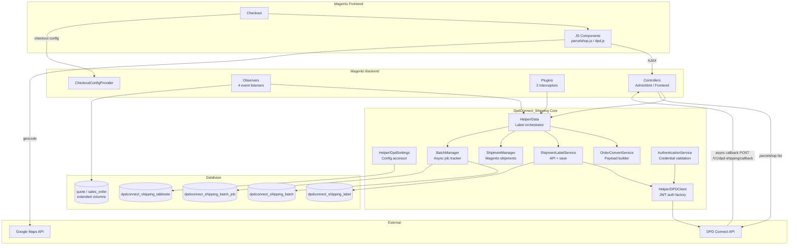
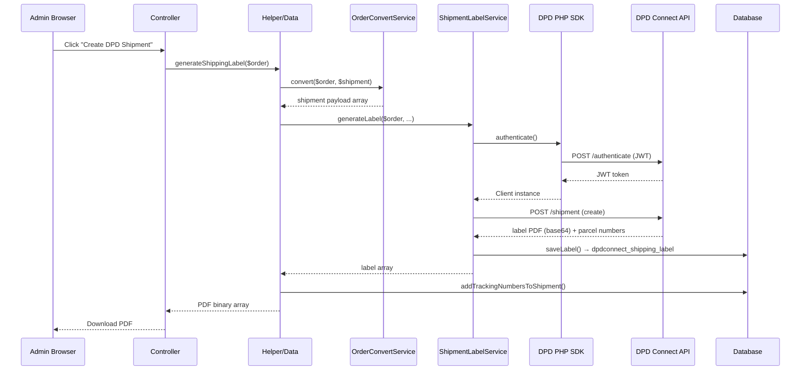
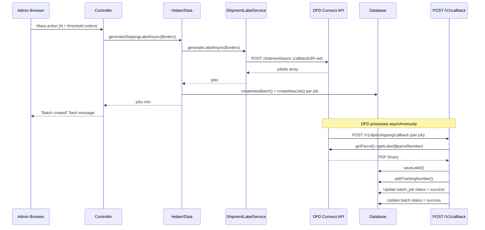

<!--
DOCS_METADATA:
  generated_at: 2026-02-19T08:31:16Z
  git_hash: 4b2b46b
  tool_version: 1.0.0
  source_command: /create-magento-documentation
-->

# Architecture Diagrams

<!-- AUTO-GENERATED:START - Do not edit manually -->

## Module Component Overview

## Request Flow: Sync Label Generation

## Request Flow: Async Label Generation

<!-- AUTO-GENERATED:END -->

<!-- MANUAL:START - Safe to edit, preserved on updates -->
<!-- MANUAL:END -->
