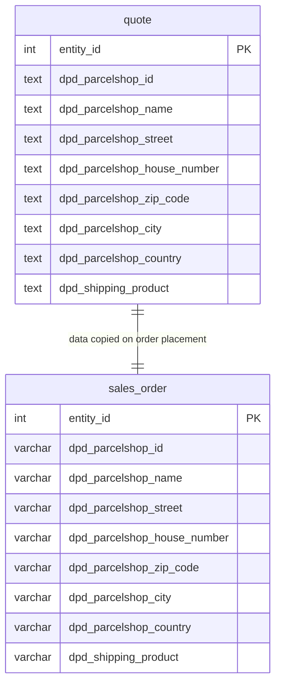

<!--
DOCS_METADATA:
  generated_at: 2026-02-19T08:31:16Z
  git_hash: 4b2b46b
  tool_version: 1.0.0
  source_command: /create-magento-documentation
-->

# Database ERD

<!-- AUTO-GENERATED:START - Do not edit manually -->

## Custom Tables

```mermaid
erDiagram
    dpdconnect_shipping_batch {
        int entity_id PK
        timestamp created_at
        timestamp updated_at
        varchar status
    }

    dpdconnect_shipping_batch_job {
        int entity_id PK
        int batch_id FK
        timestamp created_at
        timestamp updated_at
        int order_id FK
        varchar order_increment_id
        int shipment_id FK
        varchar shipment_increment_id
        varchar job_id
        text error_message
        varchar type
        varchar status
    }

    dpdconnect_shipping_label {
        int entity_id PK
        timestamp created_at
        timestamp updated_at
        int order_id
        varchar order_increment_id
        int shipment_id
        varchar shipment_increment_id
        varchar carrier_code
        varchar mps_id
        text label_numbers
        blob label
        text label_path
        int is_return
    }

    dpdconnect_shipping_tablerate {
        int pk PK
        varchar shipping_method
        int website_id
        varchar dest_country_id
        int dest_region_id
        varchar dest_zip
        varchar condition_name
        decimal condition_value
        decimal price
        decimal cost
    }

    sales_order {
        int entity_id PK
        varchar dpd_parcelshop_id
        varchar dpd_parcelshop_name
        varchar dpd_parcelshop_street
        varchar dpd_parcelshop_house_number
        varchar dpd_parcelshop_zip_code
        varchar dpd_parcelshop_city
        varchar dpd_parcelshop_country
        varchar dpd_shipping_product
    }

    sales_shipment {
        int entity_id PK
    }

    dpdconnect_shipping_batch ||--o{ dpdconnect_shipping_batch_job : "has jobs"
    dpdconnect_shipping_batch_job }o--|| sales_order : "belongs to"
    dpdconnect_shipping_batch_job }o--|| sales_shipment : "linked to"
```

## Modified Magento Tables



## Setup Version History

| Version | Schema change |
|---|---|
| 1.0.0 | (data) Custom EAV attributes: `hs_code`, `export_description` |
| 1.0.1 | (schema) Parcelshop columns on `quote` table |
| 1.0.1 | (data) Parcelshop columns on `sales_order` via SalesSetup |
| 1.0.2 | (schema) Create `dpdconnect_shipping_tablerate` |
| 1.0.3 | (schema) Create `dpdconnect_shipping_label` |
| 1.0.4 | (schema) Create `dpdconnect_shipping_batch` + `dpdconnect_shipping_batch_job` |
| 1.0.5 | (schema) Increase `condition_name` column length to 30 on tablerate |
| 1.0.6 | (data) Custom EAV attribute: `age_check` |
| 1.0.7 | (data) Custom EAV attributes: `dpd_shipping_type`, `dpd_fresh_description` |
| 1.0.8 | (schema) `dpd_shipping_product` column on `quote` |
| 1.0.8 | (data) `dpd_shipping_product` attribute on `sales_order` via SalesSetup |

<!-- AUTO-GENERATED:END -->

<!-- MANUAL:START - Safe to edit, preserved on updates -->
<!-- MANUAL:END -->
