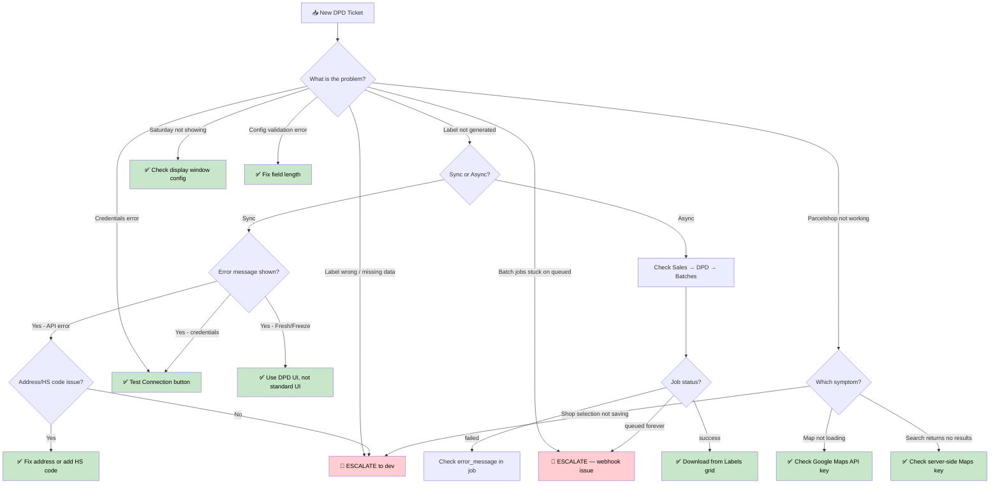

<!--
DOCS_METADATA:
  generated_at: 2026-02-19T08:31:16Z
  git_hash: 4b2b46b
  tool_version: 1.0.0
  source_command: /create-magento-documentation
-->

# Support Triage Guide

<!-- AUTO-GENERATED:START - Do not edit manually -->

## Quick Decision Tree



---

## Handle Yourself (Eerste Lijn)

### ✅ Credentials not valid

1. Go to **Stores → Config → DPD Parcelservice → Account Settings**.
2. Re-enter username and password.
3. Click **Test Connection**.
4. If still failing: credentials are wrong → contact DPD account manager.

---

### ✅ DPD Fresh/Freeze order — cannot create shipment

Error: *"shipments can only be made through the order overview or the packages screen"*

1. Open the order: **Sales → Orders → [order number]**.
2. Use the **"Create DPD Shipment"** button in the order view (NOT the standard "Ship" button).
3. Use the Packages popup to enter parcel details.

---

### ✅ Saturday delivery not showing at checkout

1. Go to **Stores → Config → Shipping Methods → DPD Saturday**.
2. Set "Shown from" and "Shown till" to the correct day and time window.
3. Example: Shown from **Monday 00:00** till **Thursday 17:00**.
4. Save and flush cache.

---

### ✅ Config validation error when saving

Error: *"The value for 'X' in group 'Y' is NOT valid"*

Field length limits:
- Name: max **35** characters
- House number: max **8** characters
- Postal code: max **9** characters
- City: max **35** characters
- Email: max **50** characters
- Phone: max **30** characters
- Country: exactly **2** characters (ISO)

Fix the flagged field and save again.

---

### ✅ JWT / cache issue — auth errors in logs

1. Go to **System → Cache Management**.
2. Click **Flush Magento Cache**.
3. This clears cached JWT tokens.
4. Next label request will re-authenticate automatically.

---

### ✅ Check async batch status

1. Go to **Sales → DPD → Batches**.
2. Find the batch by date.
3. Click on the batch to see individual jobs.
4. Job status: `queued` / `success` / `failed`.
5. If `failed`: note the `error_message` and escalate with it.
6. If `success`: go to **Sales → DPD → Labels** to download.

---

### ✅ Download a label manually

1. Go to **Sales → DPD → Labels**.
2. Filter by order ID or increment ID.
3. Click **Download** for the relevant label.
4. For bulk download: select rows → **Mass Download**.

---

## Escalate to Development 🔴

Escalate immediately when:

| Situation | Why |
|---|---|
| Batch jobs permanently stuck on `queued` | Webhook URL unreachable — requires server/infrastructure investigation |
| Label generated but data is wrong (wrong address, wrong carrier) | Data mapping bug in code |
| DPD API error that is not a credentials or address issue | May require SDK or module update |
| Parcelshop selection not being saved to order | Observer or session issue — requires code debugging |
| Any PHP exception in `var/log/exception.log` related to DPD | Code error |
| `dpdconnect_shipping_*` table errors | Database issue |
| Callback endpoint returning non-200 | Server/code error requiring dev investigation |

---

## Escalation Template

```
Subject: DPD Shipping — [brief description]

Environment: [Production / Staging / Dev]
Store: [Store name / URL]
Order number: [if applicable]
Severity: [Low / Medium / High / Critical]

---
SYMPTOM:
[What the user or support sees]

STEPS TO REPRODUCE:
1.
2.
3.

WHAT WAS CHECKED:
[ ] Test Connection button result
[ ] Batch status (Sales → DPD → Batches)
[ ] Label archive (Sales → DPD → Labels)
[ ] Admin flash messages after config save
[ ] Cache flushed: Yes / No

RELEVANT LOGS / ERROR MESSAGES:
[Paste exact error text from admin flash or var/log/exception.log]

BATCH JOB DETAILS (if applicable):
- Batch ID:
- Job ID:
- Job status:
- Error message (from DB):
```

<!-- AUTO-GENERATED:END -->

<!-- MANUAL:START - Safe to edit, preserved on updates -->
<!-- MANUAL:END -->
